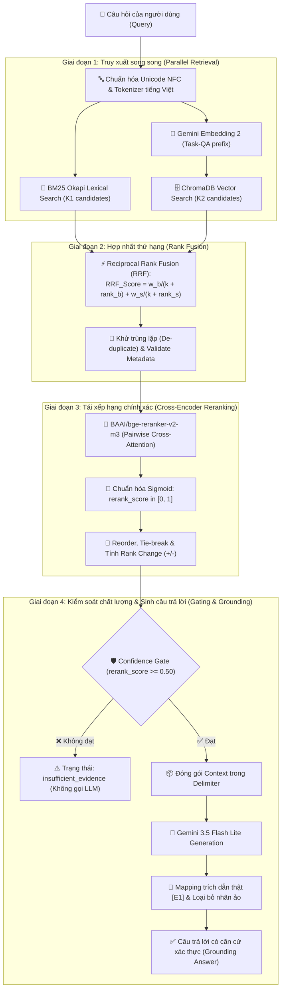

# WORKSHOP RAG ADVANCED — BUỔI 08
## Hybrid Search (BM25 + Dense Semantic) & Cross-Encoder Multilingual Reranking

---

### 1. Mục Tiêu & Sự Khác Biệt Giữa Buổi 07 và Buổi 08

Trong hệ thống RAG thực tế phục vụ các tài liệu chuyên ngành như **Văn bản Quy phạm Pháp luật Ngân hàng Nhà nước Việt Nam**, phương pháp Semantic Vector Search đơn thuần (Buổi 07) bộc lộ các điểm hạn chế cố hữu:
* **Từ khóa chính xác (Exact Match / Legal Keywords)**: Semantic Search thường đánh mất các thuật ngữ mang tính định danh chính xác như số hiệu văn bản (*Thông tư 02/2023/TT-NHNN*), các điều khoản cụ thể (*Điều 4, Khoản 2*) do vector embedding nén thông tin ngữ nghĩa tổng quát.
* **Đồng nghĩa & Ngữ nghĩa biến thể (Paraphrasing)**: Lexical Search (BM25) thuần túy lại hoàn toàn bất lực nếu người dùng không dùng đúng từ khóa trong văn bản gốc.
* **Tương quan hai chiều (Cross-Attention vs Bi-Encoder)**: Mô hình Bi-Encoder embedding mã hóa câu hỏi và văn bản độc lập nên không nắm bắt được sự tương tác chi tiết giữa từng từ trong câu hỏi với từng từ trong văn bản.

**Buổi 08 nâng cấp toàn diện lên kiến trúc Advanced Hybrid RAG cấp sản phẩm:**
1. **Truy xuất kép song song (Dual-Stage Retrieval)**: Kết hợp sức mạnh của từ khóa pháp lý tiếng Việt qua **BM25 Okapi** và ngữ nghĩa sâu của **Gemini Embedding 2**.
2. **Hợp nhất không gian thứ hạng (Reciprocal Rank Fusion - RRF)**: Chuẩn hóa và dung hợp thứ hạng từ 2 hệ thống độc lập mà không cần chuẩn hóa min-max cảm tính.
3. **Tái xếp hạng bằng Cross-Encoder (BGE Reranker v2-m3)**: Tận dụng cơ chế Full Cross-Attention để chấm điểm tương quan chính xác cao cho top ứng viên.
4. **Kiểm soát ảo giác đa tầng (Confidence Gate & Grounding)**: Gating độc lập theo mode, trích dẫn chuẩn hóa `[E1]`, `[E2]` và tự động loại bỏ các nhãn trích dẫn bịa đặt.

---

### 2. Sơ Đồ Kiến Trúc Luồng Dữ Liệu Đa Tầng



---

### 3. Cấu Trúc Thư Mục Dự Án

```text
rag_foundation/buoi_08/
├── SPEC_buoi_08.md                    # Bản đặc tả kỹ thuật 12 hợp đồng RAG
├── README.md                          # Hướng dẫn chi tiết & tài liệu nghiệm thu
├── requirements.txt                   # 7 thư viện phụ thuộc trực tiếp
├── .env.example                       # 16 tham số cấu hình mẫu
├── .gitignore                         # Loại bỏ cache, .env, storage, reports
├── rag.py                             # Bản sao độc lập Semantic Baseline Buổi 07
├── advanced_rag.py                    # Module lõi Advanced RAG (BM25, RRF, Reranker, Answer)
├── evaluate.py                        # Module đo lường định lượng Hit@K, MRR@K, Recall@K, nDCG@K
├── app.py                             # Giao diện Web Streamlit 4 tab trực quan hóa đa tầng
├── eval/
│   └── questions.json                 # Bộ 8 câu hỏi benchmark có ground truth
├── tests/
│   ├── __init__.py
│   ├── fixtures/
│   │   └── chunks_advanced_sample.json # 8 chunk mẫu tiếng Việt cho unit tests
│   ├── test_bm25.py                   # 8 unit tests BM25 Lexical Retrieval
│   ├── test_semantic_retrieval.py     # 6 unit tests Semantic Candidate Stage
│   ├── test_hybrid_fusion.py          # 10 unit tests Reciprocal Rank Fusion
│   ├── test_reranker.py               # 10 unit tests Cross-Encoder Reranking
│   ├── test_answer_pipeline.py        # 8 unit tests Grounding, Citations & Compare
│   └── test_evaluation_metrics.py     # 5 unit tests Metric formulas & Reporting
├── reports/
│   └── .gitkeep                       # Nơi lưu trữ các file báo cáo JSON sau khi evaluate
└── storage/
    ├── .gitkeep
    ├── chroma/                        # Persistent Vector DB của Buổi 08
    └── huggingface/                   # Thư mục cache mô hình Cross-Encoder Reranker
```

---

### 4. Thiết Lập Môi Trường, Requirements & Cấu Hình `.env`

Sử dụng môi trường ảo Python 3.14 chung của workshop:

```powershell
# 1. Cài đặt các thư viện trực tiếp của Buổi 08
& "..\buoi_05\.venv\Scripts\python.exe" -m pip install -r requirements.txt

# 2. Tạo file cấu hình .env từ file mẫu
Copy-Item .env.example .env
```

**16 Biến Cấu Hình trong `.env`:**
```ini
GEMINI_API_KEY=your_gemini_api_key_here
GEMINI_EMBEDDING_MODEL=gemini-embedding-2
GEMINI_EMBEDDING_DIM=768
GEMINI_GENERATION_MODEL=gemini-3.5-flash-lite
RAG_MAX_DISTANCE=0.45
BM25_CANDIDATES=20
SEMANTIC_CANDIDATES=20
RRF_K=60
RRF_BM25_WEIGHT=1.0
RRF_SEMANTIC_WEIGHT=1.0
RERANK_CANDIDATES=20
FINAL_TOP_K=5
RERANKER_MODEL=BAAI/bge-reranker-v2-m3
RERANKER_MAX_LENGTH=512
RERANK_BATCH_SIZE=4
RERANK_MIN_SCORE=0.50
RERANK_DEVICE=auto
```

> [!WARNING]
> **Cảnh báo về Tài nguyên & Dung lượng Mô hình Reranker:**
> Mô hình `BAAI/bge-reranker-v2-m3` có dung lượng khoảng **2.2 GB**. Trong lần chạy đầu tiên, mô hình sẽ được tải tự động từ Hugging Face Hub về thư mục cục bộ `storage/huggingface/`. Quá trình này đòi hỏi kết nối Internet ổn định và tối thiểu 4 GB RAM còn trống.

---

### 5. Danh Mục Câu Lệnh CLI Hoàn Chỉnh

Tất cả các lệnh đều được thực thi thông qua interpreter của môi trường ảo:

```powershell
# 1. Kiểm tra trạng thái hệ thống (Read-Only 100%, không gọi API, không tải model)
& "..\buoi_05\.venv\Scripts\python.exe" advanced_rag.py status --strategy hierarchical

# 2. Nạp dữ liệu Vector Embedding thật vào ChromaDB Buổi 08 (Idempotent)
& "..\buoi_05\.venv\Scripts\python.exe" advanced_rag.py prepare-semantic --strategy hierarchical

# 3. Chẩn đoán truy xuất từ khóa BM25
& "..\buoi_05\.venv\Scripts\python.exe" advanced_rag.py bm25 --strategy hierarchical --question "Điều 7 quy định gì?" --top-k 5

# 4. Chẩn đoán truy xuất Vector Semantic
& "..\buoi_05\.venv\Scripts\python.exe" advanced_rag.py semantic --strategy hierarchical --question "Điều 7 quy định gì?" --top-k 5

# 5. Chẩn đoán hợp nhất thứ hạng Hybrid RRF
& "..\buoi_05\.venv\Scripts\python.exe" advanced_rag.py hybrid --strategy hierarchical --question "Điều 7 quy định gì?" --top-k 5

# 6. Chẩn đoán Tái xếp hạng bằng Cross-Encoder
& "..\buoi_05\.venv\Scripts\python.exe" advanced_rag.py rerank --strategy hierarchical --question "Điều 7 quy định gì?" --top-k 5

# 7. So sánh song song 4 chế độ truy xuất (KHÔNG gọi LLM generation)
& "..\buoi_05\.venv\Scripts\python.exe" advanced_rag.py compare --strategy hierarchical --question "Điều 7 quy định gì?"

# 8. Hỏi-Đáp hoàn chỉnh với Grounding Prompt & Citations (Gọi LLM đúng 1 lần)
& "..\buoi_05\.venv\Scripts\python.exe" advanced_rag.py query --mode hybrid_rerank --strategy hierarchical --question "Điều 7 quy định gì?"

# 9. Chạy đánh giá định lượng Benchmark
& "..\buoi_05\.venv\Scripts\python.exe" evaluate.py --strategy hierarchical --k 5

# 10. Khởi chạy Giao diện Web Streamlit
& "..\buoi_05\.venv\Scripts\python.exe" -m streamlit run app.py
```

---

### 6. Giải Thích Các Thang Đo & Cơ Chế Lọc Phễu Ứng Viên

| Chỉ số / Thang đo | Miền giá trị | Chiều hướng tối ưu | Ý nghĩa kỹ thuật |
|---|---|---|---|
| **BM25 Score** | $[0, +\infty)$ | **Càng cao càng tốt** | Đo lường mức độ trùng khớp từ khóa có trọng số theo tần suất và độ dài văn bản. |
| **Cosine Distance** | $[0, 2]$ | **Càng thấp càng tốt** | Đo khoảng cách góc trong không gian vector đa chiều (0.0 là đồng nhất hoàn toàn). |
| **RRF Score** | $(0, 1)$ | **Càng cao càng tốt** | Điểm số hợp nhất thứ hạng nghịch đảo: $\sum \frac{w}{k + rank}$. |
| **Rerank Score** | $[0, 1]$ | **Càng cao càng tốt** | Điểm tương quan qua hàm $\text{Sigmoid}(\text{logit})$. *(Lưu ý: Không phải xác suất đúng tuyệt đối)*. |

#### Cơ Chế Lọc Phễu Ứng Viên (Candidate Funneling):
1. **BM25 Stage**: Trích xuất $K_1 = 20$ chunks từ khóa hàng đầu.
2. **Semantic Stage**: Trích xuất $K_2 = 20$ chunks vector tương đồng nhất.
3. **RRF Union Stage**: Hợp nhất và loại trùng, thu được tập ứng viên (khoảng $20 \sim 40$ chunks).
4. **Rerank Stage**: Đưa tối đa $\min(20, \text{union})$ chunks vào mô hình Cross-Encoder để chấm điểm.
5. **Confidence Gate**: Lọc các chunks có $\text{rerank\_score} \ge 0.50$.
6. **Final Top-K**: Chỉ giữ lại đúng $K_{\text{final}} = 5$ chunks xuất sắc nhất để đưa vào Prompt ngữ cảnh.

---

### 7. Đo Lường Định Lượng Benchmark & Giới Hạn Của Bộ Dữ Liệu Chuẩn

Module `evaluate.py` cung cấp 4 chỉ số chất lượng truy xuất:
* **Hit@K**: Tỷ lệ câu hỏi tìm thấy ít nhất 1 chunk đúng trong top-$K$.
* **MRR@K (Mean Reciprocal Rank)**: Nghịch đảo thứ hạng của chunk đúng đầu tiên ($\frac{1}{\text{rank}}$).
* **Recall@K**: Tỷ lệ số chunk đúng tìm thấy trên tổng số chunk liên quan trong ground truth.
* **nDCG@K (Normalized Discounted Cumulative Gain)**: Đánh giá chất lượng xếp hạng có xét đến vị trí ưu tiên của tài liệu đúng.

> [!IMPORTANT]
> **Giới hạn của tập nhãn Ground Truth (`eval/questions.json`):**
> Trong môi trường workshop thực hành, bộ câu hỏi chuẩn có gắn cờ `needs_human_review=true`. Kết quả đánh giá chỉ phản ánh tương đối hiệu quả tương đối giữa các phương pháp và **không tuyên bố một chế độ truy xuất chiến thắng tuyệt đối** khi chưa được chuyên gia pháp lý thẩm định 100%.

---

### 8. Bộ Câu Hỏi Đối Chiếu Mẫu (Manual Comparison Questions)

Để trải nghiệm sự khác biệt rõ nét giữa các chế độ truy xuất trên Tab 2 của Streamlit:

#### A. Câu hỏi từ khóa chính xác (Exact Legal Reference):
* **Câu hỏi**: *"Điều 7 quy định như thế nào về cơ cấu lại thời hạn trả nợ?"*
* **Hiện tượng**: BM25 xuất sắc bắt trúng chính xác Điều 7; Semantic có thể bị phân tán sang các điều khoản lân cận. Hybrid + Rerank giữ vững thứ hạng cao nhất cho chunk Điều 7.

#### B. Câu hỏi diễn đạt ngữ nghĩa (Paraphrase Semantic):
* **Câu hỏi**: *"Khách hàng gặp khó khăn có thể được điều chỉnh kỳ hạn trả nợ ra sao?"*
* **Hiện tượng**: BM25 kém hiệu quả do thiếu cụm từ pháp lý chuẩn hóa; Semantic Search tìm thấy đúng Điều 4 (cơ cấu nợ do khó khăn). Reranker kéo chunk này lên vị trí Top 1.

#### C. Câu hỏi đa khái niệm (Multi-Concept):
* **Câu hỏi**: *"Phân loại nợ và trích lập dự phòng được thực hiện như thế nào?"*
* **Hiện tượng**: RRF hợp nhất đồng thời các chunk về phân loại nợ từ Thông tư 02 và Thông tư 39, Cross-Encoder sắp xếp lại thứ tự ưu tiên logic.

#### D. Câu hỏi ngoài phạm vi (Out-of-Scope):
* **Câu hỏi**: *"Ngân hàng nào có lãi suất tiết kiệm cao nhất hôm nay?"*
* **Hiện tượng**: Tất cả các ứng viên đều bị Confidence Gate chặn lại ($\text{rerank\_score} < 0.50$ hoặc $\text{distance} > 0.45$). Hệ thống từ chối trả lời an toàn (`insufficient_evidence`).

---

### 9. Xử Lý Sự Cố Thường Gặp (Troubleshooting)

1. **Lỗi tải mô hình Reranker (`reranker_unavailable` / Timeout)**:
   * Do mạng hoặc tường lửa chặn tải Hugging Face.
   * *Khắc phục*: Tải trước mô hình hoặc chuyển sang chế độ `hybrid` / `semantic` để tiếp tục làm việc mà không cần reranker.
2. **Hệ thống chạy chậm trên CPU**:
   * Cross-Encoder tính toán ma trận ma sát trên CPU có thể mất $200 \sim 800\text{ ms}$ cho mỗi câu hỏi.
   * *Khắc phục*: Giảm `RERANK_CANDIDATES=10` hoặc `RERANK_BATCH_SIZE=2` trong `.env`.
3. **Lỗi `Collection chưa tồn tại`**:
   * *Khắc phục*: Chạy lệnh `python advanced_rag.py prepare-semantic --strategy hierarchical` để nạp dữ liệu vector vào ChromaDB của Buổi 08.

---

### 10. Tuyên Bố Miễn Trừ Trách Nhiệm (Disclaimer)
> Ứng dụng và mã nguồn được xây dựng cho mục đích học tập và nghiên cứu công nghệ RAG nâng cao trong khuôn khổ Workshop. Nội dung câu trả lời do mô hình AI tổng hợp không cấu thành lời khuyên hay văn bản hướng dẫn pháp lý chính thức của Ngân hàng Nhà nước Việt Nam.
